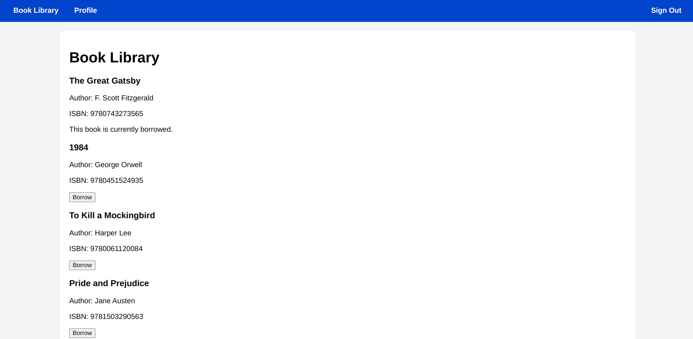

# 📚 Book Lending Library

Welcome to the **Book Lending Library**, a full-stack application built with **Ruby on Rails 8**. This platform allows users to **browse, borrow, and return books**, making book lending seamless and efficient.

## 🚀 Features
- 📖 **User Authentication** (Devise): Secure sign-up, login, and logout.
- 🔄 **Borrow & Return System**: Users can borrow and return books with status tracking.
- 📊 **Dashboard**: View borrowed books and history.
- 🔐 **Authorization**: Role-based access .

## 🛠 Tech Stack
- **Frontend:** HTML, CSS, JavaScript (Stimulus.js for interactivity)
- **Backend:** Ruby on Rails 8
- **Database:** PostgreSQL
- **Authentication:** Devise

## 🏗 Setup & Installation
1. **Clone the repository**
   ```sh
   git clone https://github.com/mcgarretronald/book_library.git
   cd book-library
   ```
2. **Install dependencies**
   ```sh
   bundle install
   ```
3. **Setup the database**
   ```sh
   rails db:create db:migrate db:seed
   ```
4. **Run the server**
   ```sh
   rails server
   ```
5. **Access the app** at [http://localhost:3000](http://localhost:3000)

## 🧩 API Endpoints
- `GET /books` - Retrieve all books
- `POST /borrowings` - Borrow a book
- `PATCH /borrowings/:id/return` - Return a book
- `GET /profile -UserProfile
## 📸 Screenshots


## 🤝 Contributing
Contributions are welcome! Feel free to fork and submit pull requests.

## 📬 Contact Me
**Ronald McGarret Otieno**  
📩 Email: [mcgarretronald@gmail.com](mailto:mcgarretronald@gmail.com)  
🌍 Portfolio: [ronaldmcgarret.vercel.app](https://ronaldmcgarret.vercel.app)  
🔗 GitHub: [github.com/mcgarretronald](https://github.com/mcgarretronald)  
💼 LinkedIn: [linkedin.com/in/ronald-mcgarret/](https://linkedin.com/in/ronald-mcgarret/)  


